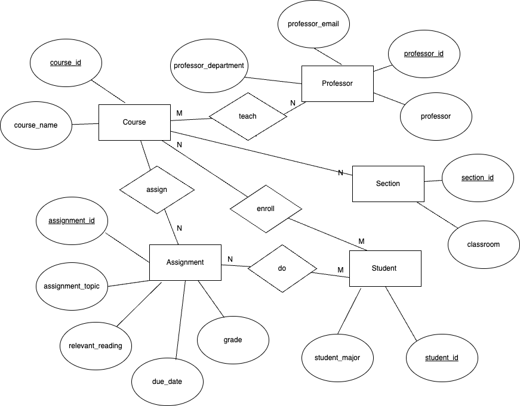

# Data Normalization and Entity-Relationship Diagramming

An assignment to normalize the structure of data and establish a set of Entity-Relationship Diagrams for the data.

The contents of this file will be deleted and replaced with the content described in the [instructions](./instructions.md)

## 1. A table containing the original dataset

I added an additional three fields including Course Name, Student Major, and Professor Department.

| assignment_id | student_id | due_date | professor | assignment_topic                | classroom | grade | relevant_reading    | professor_email   | course_name                 | student_major       | professor_department |
| ------------- | ---------- | -------- | --------- | ------------------------------- | --------- | ----- | ------------------- | ----------------- | --------------------------- | ------------------- | -------------------- |
| 1             | 1          | 23.02.21 | Melvin    | Data normalization              | WWH 101   | 80    | Deumlich Chapter 3  | l.melvin@foo.edu  | Databases                   | Computer Science    | Computer Science     |
| 2             | 7          | 18.11.21 | Logston   | Single table queries            | 60FA 314  | 25    | Dümmlers Chapter 11 | e.logston@foo.edu | Data Analysis               | Information Systems | Computer Science     |
| 1             | 4          | 23.02.21 | Melvin    | Data normalization              | WWH 101   | 75    | Deumlich Chapter 3  | l.melvin@foo.edu  | Introduction to Programming | Computer Science    | Computer Science     |
| 5             | 2          | 05.05.21 | Logston   | Python and pandas               | 60FA 314  | 92    | Dümmlers Chapter 14 | e.logston@foo.edu | Data Analysis               | Data Science        | Computer Science     |
| 4             | 2          | 04.07.21 | Nevarez   | Spreadsheet aggregate functions | WWH 201   | 65    | Zehnder Page 87     | i.nevarez@foo.edu | Business Analytics          | Data Science        | Business             |

## 2. Description of what makes this data set not compliant with 4NF

1. There could be transitive dependencies such as professor and professor_email, suggesting that professor_email is dependent on professor rather than on the primary key (assignment_id or student_id). The same could apply to course_name and classroom, where classroom might depend on course_name rather than the primary keys.

2. The dataset has multivalued dependencies which are not aligned with 4NF. For example,

- a 'professor' can be assigned to multiple 'course_name' and potentially multiple 'classroom' as well.
- a 'course_name' can have multiple 'assignment_topic'

3. Solution: In order to convert the table into 4NF, we need to decompose the table into smaller tables that eliminate these multivalued dependencies and reduce the redundancy in previous NF.

## 3. Tables containing the 4NF-compliant version of the data set

Each table represent only first few samples of data.

1. Student Table

| student_id | student_major       |
| ---------- | ------------------- |
| 1          | Computer Science    |
| 7          | Information Systems |
| 4          | Computer Science    |
| 2          | Data Science        |

2. Professor Table

| professor_id | professor | professor_email   | professor_department |
| ------------ | --------- | ----------------- | -------------------- |
| 1            | Melvin    | l.melvin@foo.edu  | Computer Science     |
| 2            | Logston   | e.logston@foo.edu | Computer Science     |
| 3            | Nevarez   | i.nevarez@foo.edu | Business             |

3. Course Table

| course_id | course_name                 |
| --------- | --------------------------- |
| 1         | Databases                   |
| 2         | Data Analysis               |
| 3         | Business Analytics          |
| 4         | Introduction to Programming |

4. Assignment Table

| assignment_id | course_id | assignment_topic                | due_date | relevant_reading    |
| ------------- | --------- | ------------------------------- | -------- | ------------------- |
| 1             | 1         | Data normalization              | 23.02.21 | Deumlich Chapter 3  |
| 2             | 2         | Single table queries            | 18.11.21 | Dümmlers Chapter 11 |
| 3             | 2         | Python and pandas               | 05.05.21 | Dümmlers Chapter 14 |
| 4             | 3         | Spreadsheet aggregate functions | 04.07.21 | Zehnder Page 87     |

5. Section Table

| section_id | professor_id | course_id | classroom |
| ---------- | ------------ | --------- | --------- |
| 1          | 1            | 1         | WWH 101   |
| 2          | 2            | 2         | 60FA 314  |
| 3          | 1            | 4         | WWH 101   |
| 4          | 3            | 3         | WWH 201   |

6. Grade Table

| assignment_id | student_id | grade |
| ------------- | ---------- | ----- |
| 1             | 1          | 80    |
| 2             | 7          | 25    |
| 1             | 4          | 75    |
| 5             | 2          | 92    |
| 4             | 2          | 65    |

## 4. ER Diagram

## 5. Description of what changes I made to make the data 4NF
